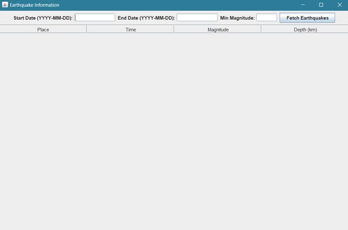
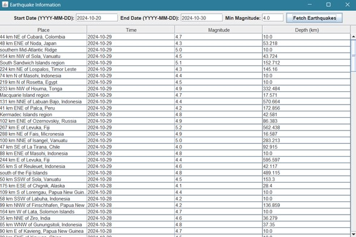

# clienteAPI
LABORATORIO PARA EL DESPLIEGUE DE APLICACIONES EMPRESARIALES

Práctica: Cliente de una API

La API de USGS ofrece datos extensos sobre eventos sísmicos y se puede configurar para filtrar por magnitud, ubicación y fechas específicas. 
Este ejemplo consulta los terremotos ocurridos entre dos fechas y permite filtrar por la magnitud mínima:

Para fines más prácticos esta versión permite especificar una fecha de inicio, una fecha de fin, y una magnitud mínima para filtrar los terremotos.
La API de USGS utiliza parámetros starttime, endtime y minmagnitude para filtrar los resultados:

Finalmente la consulta esta personalizada para mostrar información relevante de los terremotos, incluyendo ubicación (place), fecha (time), magnitud (mag) y profundidad.
